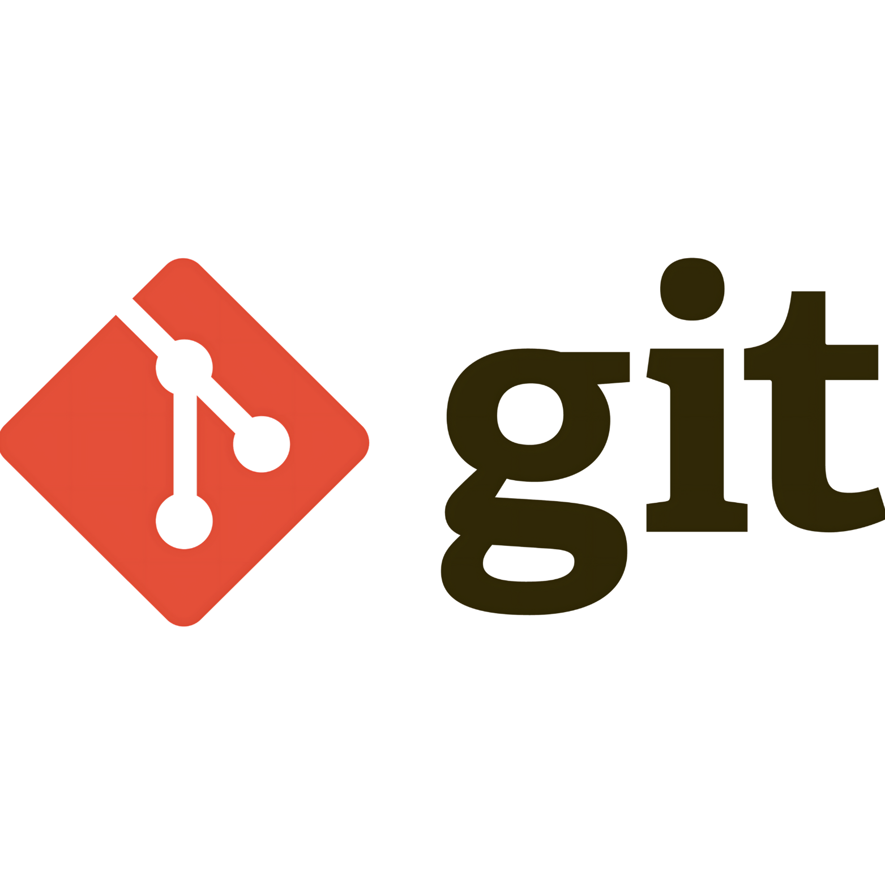

<h1 align="center">Hi 👋, I'm Hafsa Khan Lodhi</h1>
<h3 align="center">👋 Hey there! I'm Hafsa Khan Lodhi, a passionate backend developer based in Karachi, Pakistan.</h3>

👩‍💻 With a love for problem-solving and a keen eye for detail, I specialize in crafting robust backend solutions to drive seamless and efficient application functionality.
🚀 #CodeArt #BackendMagic

- 🚀 I'm a JavaScript enthusiast.
- 🌱 I'm currently exploring the world of web development with a focus on JavaScript & MongoDB.
- 💬 Feel free to reach out to me through my email: hafsalodhi2023@gmail.com.
- ⚡ Fun fact: I love solving complex backend coding challenges and puzzles.
- 📐 Strong understanding of web accessibility and best coding practices.
- 🌐 A passion for staying up-to-date with the latest web technologies.
- 🚀 for showcasing your enthusiasm and drive.
- 💻 to symbolize your proficiency in coding and technology.
- 🔧 for highlighting your problem-solving skills.
- 🌟 to signify excellence or mastery in your field.
- 📚 to represent your commitment to continuous learning.
- 👩‍💻 to show your identity as a female developer.
- 🇵🇰 to proudly represent your Pakistani heritage and location.

- **🌱 What's Next:** I'm always eager to learn and grow in the ever-evolving world of web development. I'm currently exploring [specific technology or framework], and I'm excited to share my future projects with you. Let's collaborate, create, and make the web a better place, one line of code at a time. 🚀 Feel free to explore and contribute to my projects!

## 🛠️ Technologies

Here are some of the technologies I work with:

- 🧰 JavaScript
- 🐙 Git
- :octocat: GitHub
- 📮 Postman
- 🍃 MongoDB Atlas
- 🥬 MongoDB Compass
- 🐚 Mongo Shell
- 🚀 NodeJS
- 🦡 MongooseJS
- 🚂 ExpressJS

## 📦 My Repositories

Here are some of the projects I've been working on:

1. [QR CODE GENERATOR](https://hafsalodhi2023.github.io/QR_code_generator)
   - QR Code Project for URL Generation is a user-friendly repository crafted for simplicity and ease of use. Perfect for those new to QR code projects, this tool focuses on generating QR codes exclusively for URLs. With a straightforward interface, users can effortlessly create QR codes for web links, making it an ideal starting point for individuals exploring basic QR code functionality.

2. [WHATSAPP MESSAGE FORM](https://hafsalodhi2023.github.io/Whatsapp-Message-Form)
   - The 'WhatsApp Message Form' repository seamless solution for effortlessly sending form data directly to your WhatsApp. This repository allowing users to receive submitted data conveniently on their WhatsApp account. This project enhances communication by merging the simplicity of forms with the immediacy of WhatsApp messaging, creating a powerful and efficient way to collect and manage information.

3. [FILTERABLE IMAGE GALLERY](https://hafsalodhi2023.github.io/filterable-image-gallery)
   - The 'Simple Beginner Image Gallery,' a user-friendly repository designed for those taking their first steps into image management. This project features a straightforward gallery with an intuitive search filter, making it easy for beginners to organize and find images effortlessly. 

## GitHub Status

## Languages Status

## Contribution Graph

## 🧰 Languages and Tools:

&nbsp;&nbsp;&nbsp;&nbsp;|&nbsp;&nbsp;&nbsp;&nbsp;
&nbsp;&nbsp;&nbsp;&nbsp;|&nbsp;&nbsp;&nbsp;&nbsp;
&nbsp;&nbsp;&nbsp;&nbsp;|&nbsp;&nbsp;&nbsp;&nbsp;
&nbsp;&nbsp;&nbsp;&nbsp;|&nbsp;&nbsp;&nbsp;&nbsp;
&nbsp;&nbsp;&nbsp;&nbsp;|&nbsp;&nbsp;&nbsp;&nbsp;
&nbsp;&nbsp;&nbsp;&nbsp;|&nbsp;&nbsp;&nbsp;&nbsp;
&nbsp;&nbsp;&nbsp;&nbsp;|&nbsp;&nbsp;&nbsp;&nbsp;

## 🏆 My Trophies
 

## 🤝 Connect with me:
Feel free to explore and contribute to these projects!

## 🌐 Social Media

 &nbsp;   &nbsp; 

## ❤️ Support

If you find my work interesting or have any questions, feel free to email me.

### Thanks for visiting! 😊
